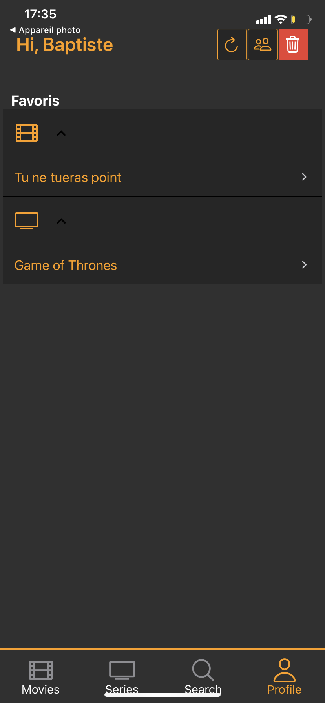

<p align="center">
  <br>
</p>

<p align="center">
  
  
  
</p>

## Contributors

**Baptiste CERDAN - Janos FALKE - Victor VOGT**

## General

Mobile application for movies and shows. (available on iOS and Android)
Made with [React Native](https://reactnative.dev/), [Expo](https://expo.dev/) and the public API [TMDb](https://www.themoviedb.org/).


## Screenshots




## Features

- Shows and movies details search
- Profile management
- Favorites movies and shows
- Redux offline
- SQLite database

## Launch with Expo.dev

You can launch via Expo installed on your mobile.
Just scan the following flashcode within your Expo application : [https://expo.dev/@jfalke/MediaHub](https://expo.dev/@jfalke/MediaHub).

## Installation

Make sure you configured the React Native environment [ici](https://reactnative.dev/docs/environment-setup).

Clone the project

```sh
$ git clone https://git.unistra.fr/v.vogt/pm-media-hub
$ cd pm-media-hub
```

Install dependancies

```sh
$ npm install
```

Launch on iOS/Android

```sh
$ npm start
or
$ expo start
```

## Licences

Université de Strasbourg - Master 2 Sciences et Ingénierie du Logiciel - Programmation Mobile - 2021/2022
