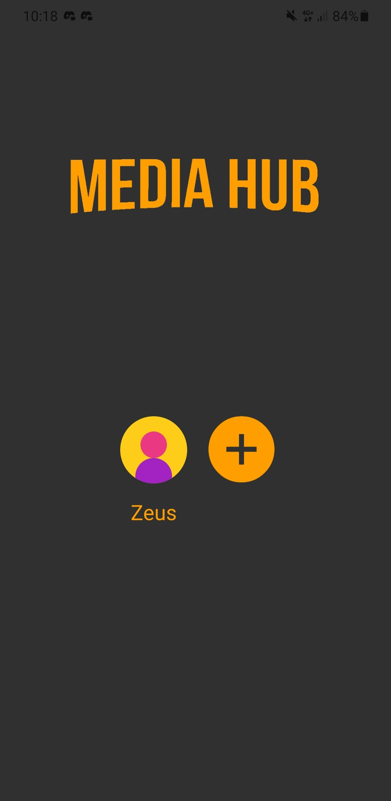
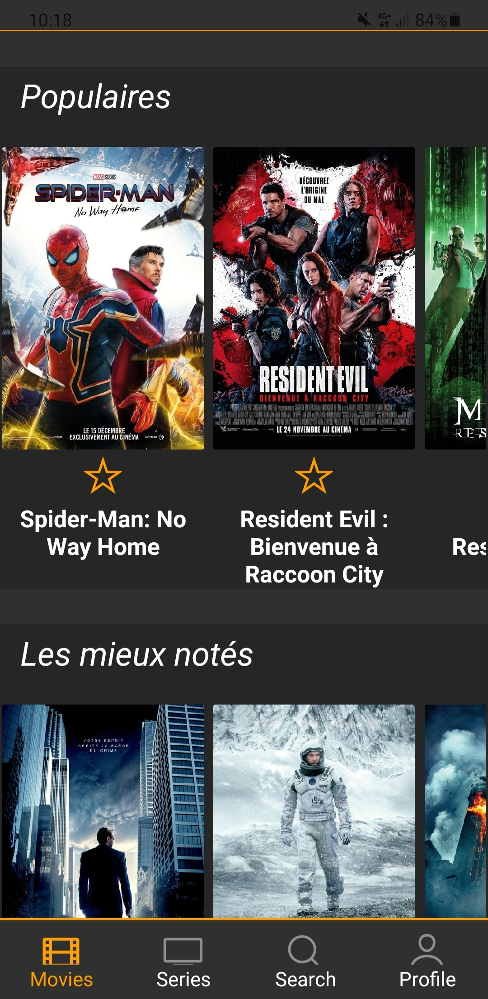
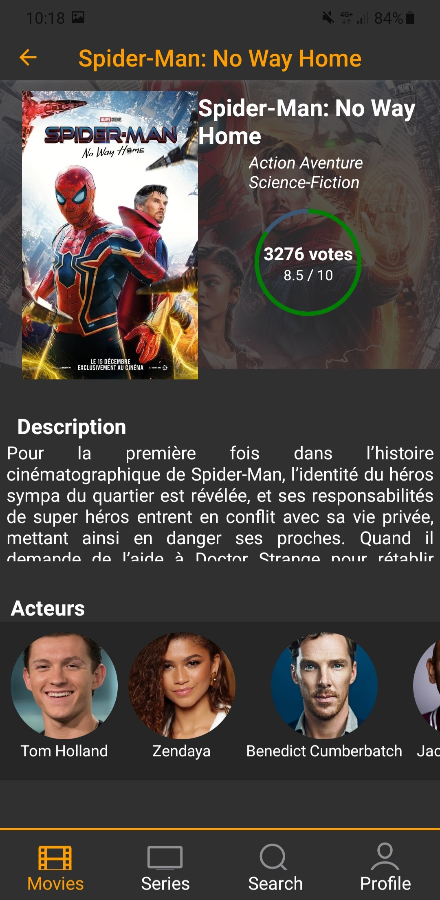
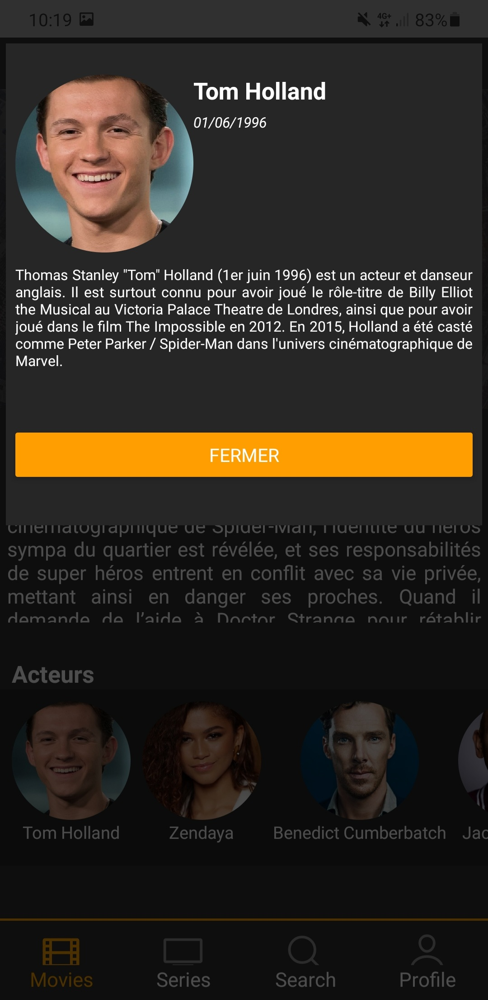
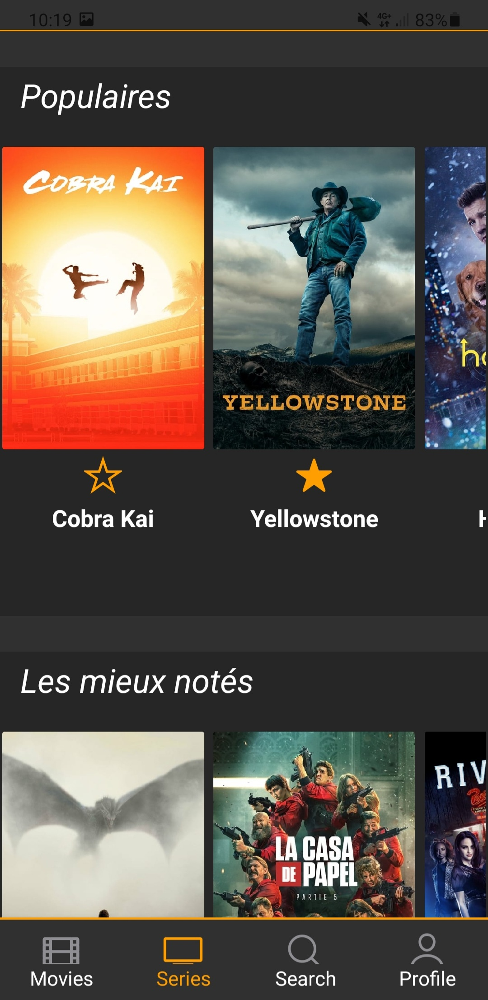
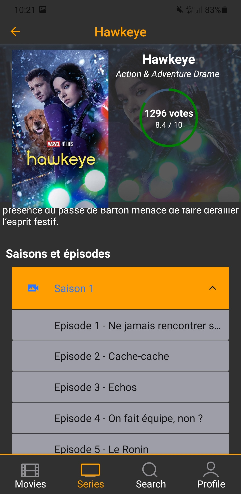
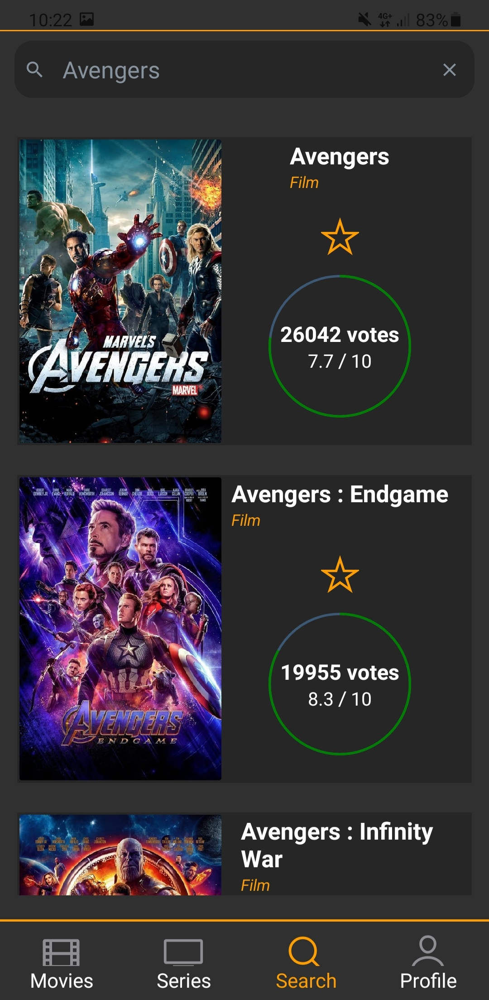

<p style="margin: 0 auto" align="center">
  <br>
</p>

<p align="center">
  
  
  
</p>

## Vue d'ensemble

Application mobile pour les films et les émissions de télévision. Disponible pour iOS et Android.
Développée en tant que projet universitaire (Programmation Mobile 2021-2022), créée à l'aide de [React Native](https://reactnative.dev/), [Expo](https://expo.dev/) et de l'API [TMDb](https://www.themoviedb.org/).

## Captures d'écran









## Fonctionnalités

- Recherche de films et d'émissions de télévision
- Découvrir la télévision et les films
- Voir les images liées au film
- Fournir des informations sur les épisodes de chaque saison
- Création de comptes
- Gestion de vos films et séries préférés
- Et bien plus encore

## Installation

Assurez-vous que vous avez configuré l'environnement natif de react [ici].(https://reactnative.dev/docs/environment-setup)

Clonez ce projet

```sh
$ git clone https://git.unistra.fr/v.vogt/pm-media-hub
$ cd pm-media-hub
```

Installez les dépendances

```sh
$ npm install
```

Exécutez sur android et ios

```sh
$ npm start
or
$ expo start
```

## Licences

Université de Strasbourg - Master 2 Sciences et Ingénierie du Logiciel - Programmation Mobile - 2021/2022
